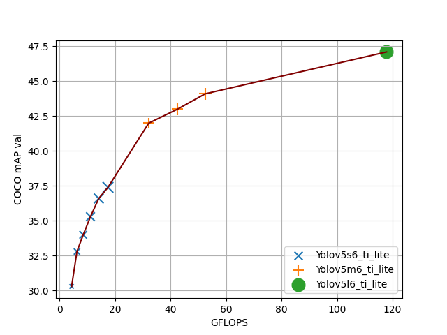

# YOLOV5-ti-lite Object Detection Models
This repository is based on [ultralytics/yolov5](https://github.com/ultralytics/yolov5). As per the [Official Readme file from Ultralytics](./README_ultralytics.md), YOLOV5 is a family of object detectors with the following major differences from YOLOV3:
* Darknet-csp backbone instead of vanilla Darknet. Reduces complexity by 30%. 
* PANet feature extractor instead of FPN.
* Better box-decoding technique
* Genetic algorithm based anchor-box selection.
* Several new augmentation techniques. E.g. Mosaic augmentation

<br/>

## **Official Models from Ultralytics**

|Dataset |Model Name                      |Input Size |GigaMACS  |AP[0.5:0.95]%| AP50%|Notes |
|--------|------------------------------- |-----------|----------|-------------|------|----- |
|COCO    |Yolov5s6                        |1280x1280  |**34.8** |   43.3      | 61.9 |
|COCO    |Yolov5s6_640                    |640x640    |**8.7**  |   38.9      | 56.8 |(Train@ 1280, val@640) |
|COCO    |Yolov5m6                        |1280x1280  |**104.8**|   50.5      | 68.7 |       |
|COCO    |Yolov5m6_640                    |640x640    |**26.2** |   45.4      | 63.6 |(Train@ 1280, val@640) |
|COCO    |Yolov5l6                        |1280x1280  |**235.4**|   53.4      | 71.1 |       |
|COCO    |Yolov5l6_640                    |640x640    |**58.85**|   49.0      | 67.0 |(Train@ 1280, val@640) |

<br/>

## **YOLOV5-ti-lite model definition**
* YOLOV5-ti-lite is a version of YOLOV5 from TI for efficient edge deployment. This naming convention is chosen to avoid conflict with future release of YOLOV5-lite models from Ultralytics.

* Here is a brief description of changes that were made to get yolov5-ti-lite from yolov5:
    * YOLOV5 introduces a Focus layer as the very first layer of the network. This replaces the first few heavy convolution layers that are present in YOLOv3. It reduces the complexity of the n/w by 7% and training time by 15%. However, the slice operations in Focus layer are not embedded friendly and hence we replace it with a light-weight convolution layer. Here is a pictorial description of the changes from YOLOv3 to YOLOv5 to YOLOv5-ti-lite:
    <p align="left"></p>     

    * SiLU activation is not well-supported in embedded devices. it's not quantization friendly as well because of it's unbounded nature. This was observed for hSwish activation function while [quantizing efficientnet](https://blog.tensorflow.org/2020/03/higher-accuracy-on-vision-models-with-efficientnet-lite.html). Hence, SiLU activation is replaced with ReLU.
    * SPP module with maxpool(k=13, s=1), maxpool(k=9,s=1) and maxpool(k=5,s=1) are replaced with various combinations of maxpool(k=3,s=1).Intention is to keep the receptive field and functionality same. This change will cause no difference to the model in floating-point.
        *	maxpool(k=5, s=1) -> replaced with two maxpool(k=3,s=1)
        *	maxpool(k=9, s=1) -> replaced with four maxpool(k=3,s=1) 
        *   maxpool(k=13, s=1)-> replaced with six maxpool(k=3,s=1) as shown below:
        <p align="left"></p> 
        
    * Variable size inference is replaced with fixed size inference as preferred by edge devices. E.g. tflite models are exported with a fixed i/p size.
## **Training and Testing** 
* Training any model using this repo will take the above changes by default. Same commands as the official one can be used for training models from scartch. E.g.
    ```
    python train.py --data coco.yaml --cfg yolov5s6.yaml --weights '' --batch-size 64
                                           yolov5m6.yaml
    ``` 
* Yolov5-l6-ti-lite model is finetuned for 100 epochs from the official ckpt. To replicate the results for yolov5-l6-ti-lite, download the official pre-trained weights for yolov5-l6 and set the lr to 1e-3 in [hyp.scratch.yaml](data/hyp.scartch.yaml)
    ```
    python train.py --data coco.yaml --cfg yolov5l6.yaml --weights 'yolov5l6.pt' --batch-size 40
    ```
* Pretrained model checkpoints along with onnx and prototxt files are kept inside [pretrained_models](./pretrained_models). 
* Run the following command to replicate the accuracy number on the pretrained checkpoints:
    ```
    python val.py --data coco.yaml --img 640 --conf 0.001 --iou 0.65 --weights pretrained_models/yolov5s6_640_ti_lite/weights/best.pt
                                                                                                  yolov5m6_640_ti_lite
                                                                                                  yolov5l6_640_ti_lite
    ```

<br/> 

### **Models trained by TI** 

<br/> 
<p float="left">

</p>       

### **Pre-trained Checkpoints**

|Dataset |Model Name                      |Input Size |GFLOPS  |AP[0.5:0.95]%| AP50%|Notes |
|--------|------------------------------- |-----------|----------|-------------|------|----- |
|COCO    |Yolov5s6_ti_lite_640            |640x640    |**17.48**  |37.4         | 56.0 |      |
|COCO    |Yolov5s6_ti_lite_576            |576x576    |**14.16**  |36.6         | 55.7 |  (Train@ 640, val@576) |
|COCO    |Yolov5s6_ti_lite_512            |512x512    |**11.18**  |35.3         | 54.3 |  (Train@ 640, val@512) |
|COCO    |Yolov5s6_ti_lite_448            |448x448    |**8.56**  |34.0         | 52.3 |  (Train@ 640, val@448) |
|COCO    |Yolov5s6_ti_lite_384            |384x384    |**6.30**  |32.8         | 51.2 |  (Train@ 384, val@384) |
|COCO    |Yolov5s6_ti_lite_320            |320x320    |**4.38**  |30.3         | 47.6 |  (Train@ 384, val@320) |
|COCO    |Yolov5m6_ti_lite_640            |640x640    |**52.5** |44.1         | 62.9 |      |
|COCO    |Yolov5m6_ti_lite_576            |576x576    |**42.52** |43.0         | 61.9 |  (Train@ 640, val@576) |
|COCO    |Yolov5m6_ti_lite_512            |512x512    |**32.16** |42.0         | 60.5 |  (Train@ 640, val@512) |
|COCO    |Yolov5l6_ti_lite_640            |640x640    |**117.84** |47.1         | 65.6 |   This model is fintuned from the official ckpt for 100 epochs|


There are three models in the  [pretrained_models](./pretrained_models). All other results are generated for these model on a different resolution. In order to generate the accuracy number at 512x512, run the following:
   
```
python test.py --data coco.yaml --img 512 --conf 0.001 --iou 0.65 --weights pretrained_models/yolov5s6_640_ti_lite/weights/best.pt
                                                                                              yolov5m6_640_ti_lite
                                                                                              yolov5l6_640_ti_lite
```

###  **ONNX export including detection:**
* Run the following command to export the entire models including the detection part, 
``` 
    python models/export.py --weights pretrained_models/yolov5s6_640_ti_lite/weights/best.pt  --img 640 --batch 1 --simplify --export-nms --opset 11 # export at 640x640 with batch size 1
```

## **References**

[1] [Official YOLOV5 repository](https://github.com/ultralytics/yolov5/) <br>
[2] [yolov5-improvements-and-evaluation, Roboflow](https://blog.roboflow.com/yolov5-improvements-and-evaluation/) <br>
[3] [Focus layer in YOLOV5]( https://github.com/ultralytics/yolov5/discussions/3181) <br>
[4] [CrossStagePartial Network](https://github.com/WongKinYiu/CrossStagePartialNetworkss)  <br>
[5] Chien-Yao Wang, Hong-Yuan Mark Liao, Yueh-Hua Wu, Ping-Yang Chen, Jun-Wei Hsieh, and I-Hau Yeh. [CSPNet: A new backbone that can enhance learning capability of
cnn](https://arxiv.org/abs/1911.11929). Proceedings of the IEEE Conference on Computer Vision and Pattern Recognition Workshop (CVPR Workshop),2020. <br>
[6]Shu Liu, Lu Qi, Haifang Qin, Jianping Shi, and Jiaya Jia. [Path aggregation network for instance segmentation](https://arxiv.org/abs/1803.01534). In Proceedings of the IEEE Conference on Computer Vision and Pattern Recognition (CVPR), pages 8759–8768, 2018 <br>
[7] [Efficientnet-lite quantization](https://blog.tensorflow.org/2020/03/higher-accuracy-on-vision-models-with-efficientnet-lite.html)